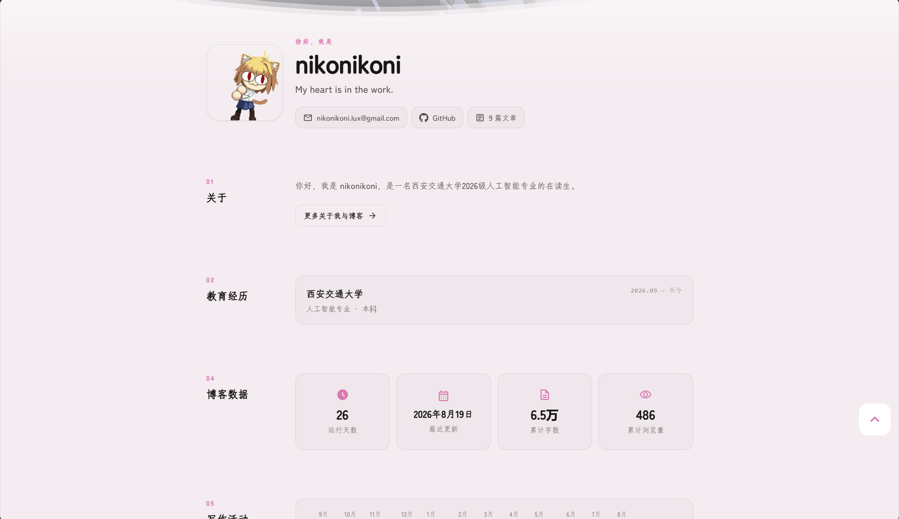

# nikonikoni blog

My personal blog and digital garden for technical notes, projects, and everyday records.

[Live site](https://miku.nikonikoni.blog/) · [中文](./README.md) · [Issues](https://github.com/ldx-ckz/NiKoNiKoNi_blog/issues)




> [!NOTE]
> This repository contains a personal website, not a general-purpose blog template.

## About

`nikonikoni blog` is an Astro-powered personal website used to publish learning notes, document projects, and experiment with content organization and frontend engineering.

Notable customizations include:

- a dashboard-style home page and activity view;
- Notes, Technical, and Daily Life content sections;
- custom post cards, categories, tags, archives, and sitemap pages;
- structured project, device, album, diary, and anime pages;
- a Codex × Obsidian knowledge-base resource;
- Pagefind search, RSS/Atom feeds, comments, analytics, and optional content synchronization.

## Development

Requirements: Node.js 24 LTS or newer and pnpm 10.

```bash
corepack enable
pnpm install
pnpm dev
```

Common commands:

| Command | Purpose |
| --- | --- |
| `pnpm dev` | Start the development server |
| `pnpm check` | Run Astro diagnostics |
| `pnpm type-check` | Run TypeScript checks |
| `pnpm build` | Build the site and search index |
| `pnpm new-post -- <name>` | Create a post |

The main configuration lives in [`src/config.ts`](./src/config.ts). Posts live in `src/content/posts/`, while structured page data lives in `src/data/`.

## Origin and licensing

This project was originally built from [LyraVoid/Mizuki](https://github.com/LyraVoid/Mizuki) and has since evolved around my own content structure, home-page experience, features, and maintenance workflow. Mizuki itself is derived from [Fuwari](https://github.com/saicaca/fuwari).

See [`THIRD_PARTY_NOTICES.md`](./THIRD_PARTY_NOTICES.md), [`LICENSE`](./LICENSE), and [`LICENSE.MIT`](./LICENSE.MIT) for attribution and licensing details. Original articles are generally published under [CC BY-NC-SA 4.0](https://creativecommons.org/licenses/by-nc-sa/4.0/) unless a post states otherwise.
