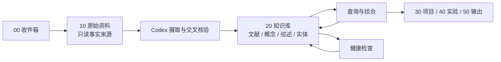

# AI 学术知识库

> [!abstract] 系统定位
> 这是一个面向人工智能学术研究的本地优先知识库。Obsidian 负责阅读、链接与浏览，Codex 负责把可信原始资料编译为可持续维护的 Wiki。

## 快速开始

1. 把论文 PDF、网页剪藏或临时想法放入 [[00-收件箱/README|00-收件箱]]。
2. 对 Codex 说：“摄取 `文件路径`，按 `AGENTS.md` 更新知识库。”
3. 在 [[20-知识库/README|20-知识库]] 检查文献笔记、概念页和主题综述。
4. 在 [[变更日志]] 检查本次修改是否可追溯。
5. 每周让 Codex 执行一次知识库健康检查。

## 工作流

## 导航

| 区域 | 说明 |
|---|---|
| [[00-收件箱/README|收件箱]] | 未分类材料与快速捕获 |
| [[10-原始资料/README|原始资料]] | 不被 Codex 改写的事实来源 |
| [[20-知识库/README|知识库]] | 文献笔记、概念、综述和实体 |
| [[30-研究项目/README|研究项目]] | 研究问题、计划和决策 |
| [[40-实验记录/README|实验记录]] | 可复现实验日志 |
| [[50-成果输出/README|成果输出]] | 报告、讲稿和论文草稿 |
| [[60-每日笔记/README|每日笔记]] | 日常阅读与研究捕获 |
| [[90-系统/README|系统]] | 模板和附件 |

## Wiki 索引

### 文献笔记

尚无。摄取第一篇论文后，由 Codex 在此添加“链接 + 一句话贡献”。

### 概念

尚无。

### 主题综述

尚无。

### 实体

尚无。

## 当前研究

尚无。使用 [[90-系统/模板/研究项目模板]] 建立第一个研究项目。

## 系统文档

- [[Codex+Obsidian人工智能学术知识库搭建教程]]
- [[AGENTS|Codex 维护规则]]
- [[变更日志]]
